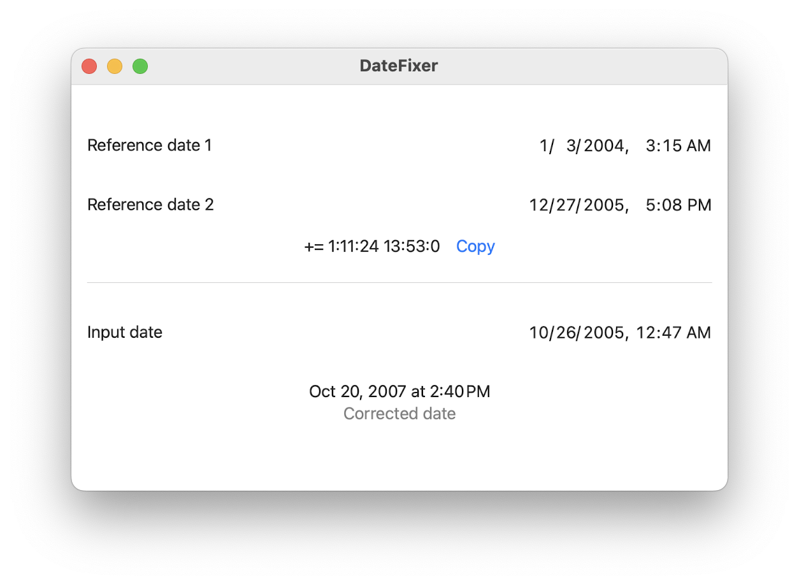

# DateFixer
A utility app for calculating the offset between two dates. I use this offset with the excellent **exiftool** command-line utility [(https://exiftool.org)](https://exiftool.org) to correct dates in the exif metadata of digital photos taken before smartphones conveniently set the exact date/time for us on every photo.

This tool is admittedly basic and clunky, but I really created it for myself as I have many photos from the early 2000s where the date was not set correctly on the digital camera.

It does what I need it to do 🙂

Usage:
- Input dates into **Reference date 1** and **Reference date 2**. The offset will be displayed below them. 
- The **Copy** button will copy the offset to the clipboard, so you can paste it into the Terminal for use with exiftool.
- Optionally, you can enter a third date in **Input date** and view the corrected date below that using the calculated offset from the two reference dates.

